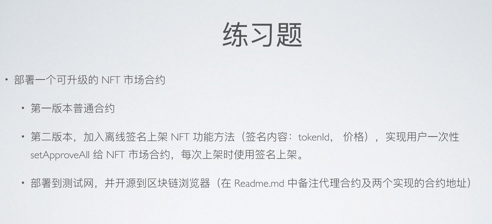

# 练习题（01.29）



## A. 合约部署总信息

1. **旧版 implementation 合约**（**NFTMarket_V2_2 合约**）：https://mumbai.polygonscan.com/address/0xc7ccE883ffFE5cD68D4AF025f0eAE38A221aD178

2. **新版 implementation 合约**（**NFTMarket_V3 合约**）：https://mumbai.polygonscan.com/address/0xad6ec1cbc25c1ce9450c7799360c6c5aae18d1f4

3. **代理合约**（**TransparentUpgradeableProxy 合约**）：https://mumbai.polygonscan.com/address/0xb6a57bf003d08b0e5b05e34ba46baaee7e278dd3

4. **代理合约的管理员合约**（**ProxyAdmin 合约**）：https://mumbai.polygonscan.com/address/0x0495ad1e9791355ab44a02b5c451f088a4dd05a1


## B. implementation 合约的代码更新

```solidity
//SPDX-License-Identifier: MIT
pragma solidity ^0.8.0;

import "@openzeppelin/contracts/token/ERC20/IERC20.sol";
import "@openzeppelin/contracts/token/ERC721/IERC721Receiver.sol";
import "@openzeppelin/contracts/token/ERC721/IERC721.sol";
import "@openzeppelin/contracts/utils/introspection/IERC165.sol";
import "@openzeppelin/contracts-upgradeable/proxy/utils/Initializable.sol";

interface NFTMarket_Standard_Interface_V1 {
    // 同旧版 implementation 合约文件的接口代码
}

/**
 * @title This is a NFT exchange contract that can provide trading for ERC721 Tokens. Various ERC721 tokens are able to be traded here.
 *
 * @author Garen Woo
 */
contract NFTMarket_V3 is Initializable, IERC721Receiver {
    // 其他代码逻辑...
		
		// 以下为新版 implementation 代码更新部分：
    /**
     * @dev Besides `list`, this function is also used to list NFT on a NFT exchange.
     *  this function verifies off-chain signature of the message signed by the owner of the NFT.
     *  List NFT in this way can have better user experience, because valid signature will lead to automatic approval.
     */
    function listWithPermit(
        address _nftAddr,
        uint256 _tokenId,
        uint256 _price,
        uint256 _deadline,
        uint8 _v,
        bytes32 _r,
        bytes32 _s
    ) external {
        if (_price == 0) revert ZeroPrice();
        require(
            onSale[_nftAddr][_tokenId] == false,
            "This NFT is already listed"
        );
        bool isPermitVerified = NFTMarket_Standard_Interface_V1(_nftAddr)
            .NFTPermit_PrepareForList(
                address(this),
                _tokenId,
                _price,
                _deadline,
                _v,
                _r,
                _s
            );
        if (isPermitVerified) {
            _List(_nftAddr, _tokenId, _price);
        }
    }

    // 其他代码逻辑...
    
}
```

